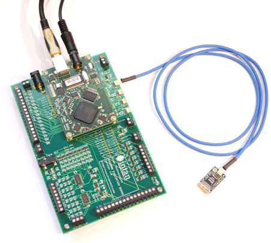

# IntanEphys

Code for documentation: 

**"Electrophysiology Analysis Optimization using Intan Technologies"** 

By [Baihan Lin](http://www.columbia.edu/~bl2681/) (at UW Olavarria Lab, Apr 2016)

(Shown here is the RHD2000 Amplifier Evaluation System, to which this code repository provides the analysis pipeline.)

## Abstract

The project is given birth due to the need to analyze a set of electrophysiology recording data and the curiosity of finding the best way to generate and present the result, and to simplify the entire electrophysiology analysis in a simple automated protocol. Comparing to the traditional method, which spends 17640 minutes (around 300 hours) to analyze the 441 cases of data files in our current stage, my method only takes less than 10 minutes, which is 1764 times faster and saves 300 hours. My method also integrates various new features such as excel-friendly log and recursive file search. I hope this method described in this documentation can offer a more systematic and convenient way in the anlaysis of electrophysiology recording data. I look forward to further improvements if any. After tens of hours of my working each week to develop this automated protocol, I hope lab members in the future can simply run the program in 10 minutes to save their time and lives profoundly.

## Published in paper:

**"Influence of Ocular Dominance Columns and Patchy Callosal Connections on Binocularity in Lateral Striate Cortex: Long Evans vs. Albino Rats"** in Journal of Comparative Neurology

For the full paper: https://onlinelibrary.wiley.com/doi/full/10.1002/cne.24786

Most analysis can be reproduced using the code in this repository. Feel free to contact me by doerlbh@gmail.com if you have any question about our work.

## Citation

If you find the later work helpful, please try the method out and cite our work. Thanks!

    @article{andelin2019influence,
      title={{Influence of Ocular Dominance Columns and Patchy Callosal Connections on Binocularity in Lateral Striate Cortex: Long Evans vs. Albino Rats}},
      author={Andelin, Adrian K and Doyle, Zane and Laing, Robyn J and Turecek, Josef and Lin, Baihan and Olavarria, Jaime F},
      journal={Journal of Comparative Neurology},
      year={2019},
      publisher={Wiley Online Library}
    }

